# Smart Dimmer

Hardware backlight and software dimming for every monitor on Windows 10 and 11, from a tray icon,
a flyout, global hotkeys and a time-of-day schedule. Standalone executable, no installation.

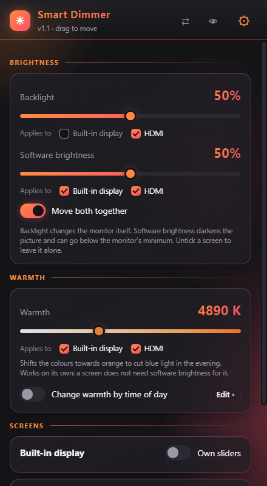

## Features

- **Two kinds of brightness.** *Hardware backlight* through DDC/CI on external monitors and WMI on the
  laptop panel, and *software dimming* through gamma ramps for screens that cannot be dimmed further
  (or at all) in hardware. Move them together or separately.
- **Per screen.** Every screen can follow the shared sliders or get its *own sliders* and its own
  hotkeys. Screens are shown by the names Windows reports for them.
- **Hotkeys.** Backlight and software up/down for all screens and for each screen, captured from the
  keyboard or mouse buttons.
- **Warmth.** A colour-temperature slider from neutral to 1900 K that cuts blue light in the
  evening, on any screen, with an f.lux-style schedule: Daytime, Evening and Bedtime, each with a
  start time and a warmth, gentle transitions and a timeline of your day.
- **Schedule.** Up to 8 time-of-day entries for backlight and software brightness, with optional
  fading, wrapping past midnight, paused automatically when you adjust something by hand.
- **On-screen indicator.** Hotkeys show the new level in a small themed bar on the screen, and
  software changes fade smoothly instead of jumping.
- **Dimming curve.** Linear or exponential mapping with a live preview, invert option and a limit on
  how dark software dimming can go.
- **Themes by time of day and weather.** An automatic mode blends a theme for morning, day, evening
  and night (cross-fading with the real sunrise and sunset) with a theme for the weather, so every
  combination of time and weather has its own palette. The *Sky* theme's own colours follow the sun and the weather.
- **Themes.** Twelve presets, each blending an accent into a second colour with soft moving glows
  (Lava Orange, Aqua Blue, Emerald Green, Lavender Pink, Milky Way, Amber Night, Synthwave, Tokyo
  Night, Nord Frost, Graphite, Cyber Neon, Northern Lights), a Custom theme, a *Wallpaper* theme that builds its
  palette from the wallpaper of the screen each window is on, and a *Sky* theme that follows the sun
  and the weather. Every preset can be edited colour by colour. *Amber Night* has no blue in it, for use at night.
- **Glass.** Windows acrylic blur behind the windows with adjustable tint, rounded corners, and an
  optional frosted copy of the wallpaper behind the glass.
- **Primary display tools.** Swap the primary display with one click or a hotkey, and optionally let
  Smart Dimmer promote the next display when the primary stops receiving power.
- **Defaults.** Save the whole configuration, restore it, factory-reset, or load your defaults at
  every start.

| Settings: Screens | Settings: Hotkeys |
|---|---|
| 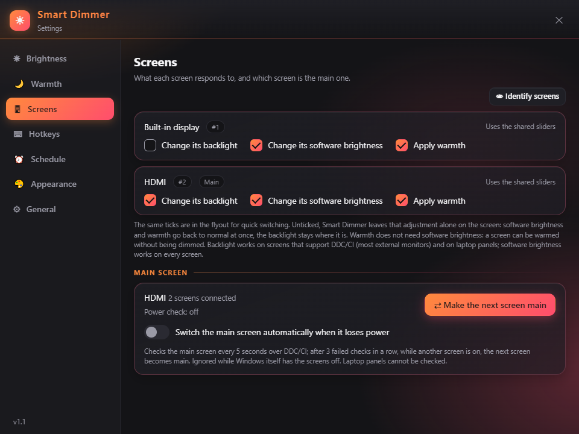 | 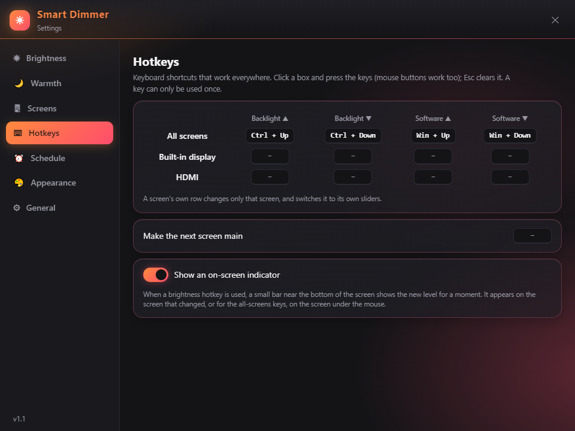 |

| Settings: Brightness | Settings: Schedule |
|---|---|
| 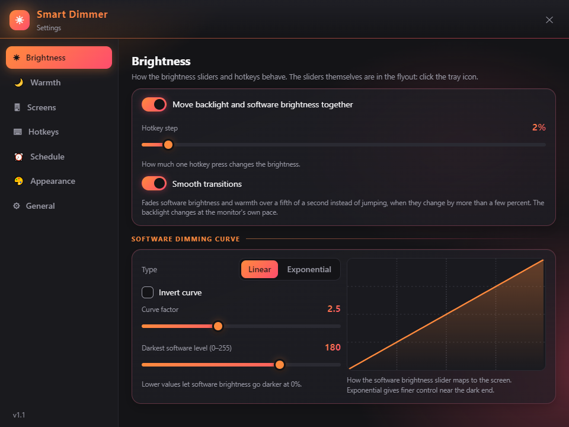 | 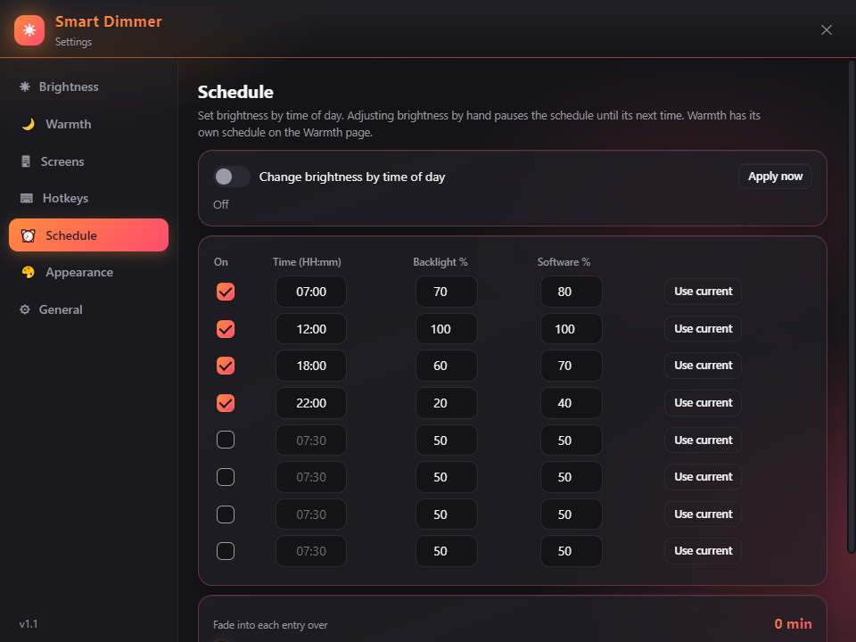 |

| Settings: Warmth | Settings: Appearance |
|---|---|
| 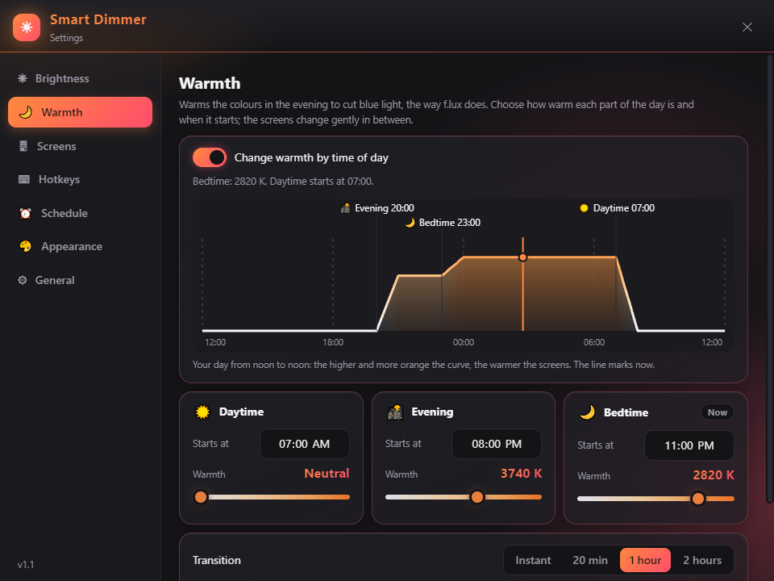 | 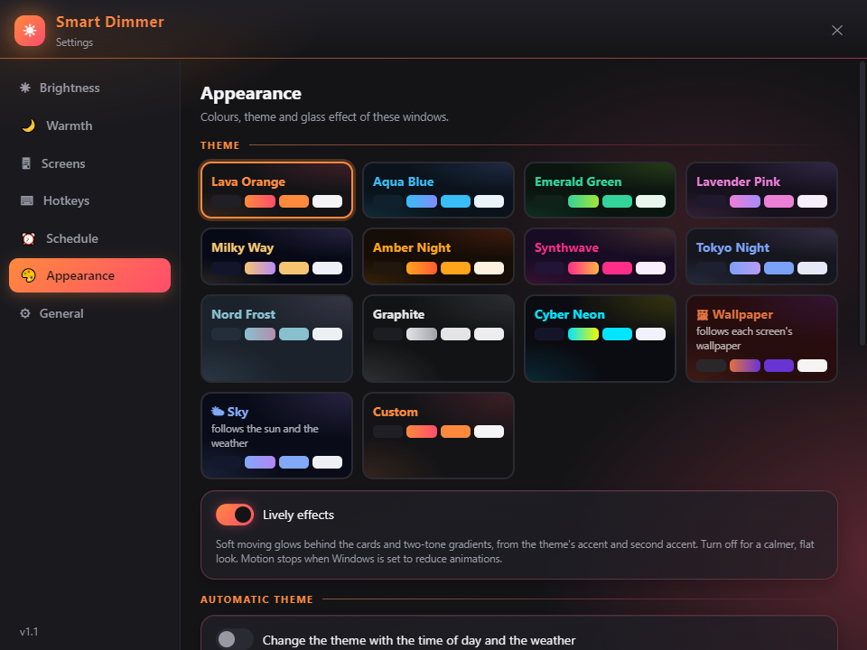 |

| Settings: General | |
|---|---|
| 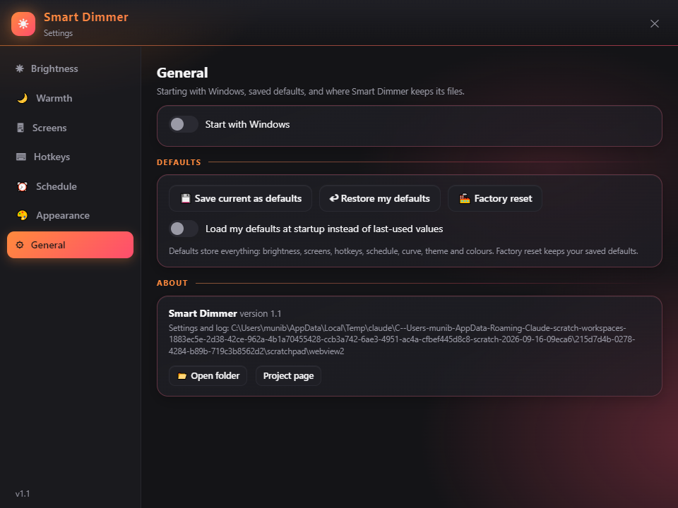 | |

| Glass mode | Wallpaper theme |
|---|---|
| 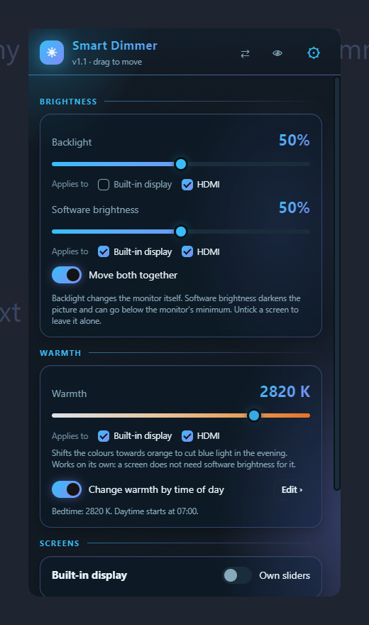 | 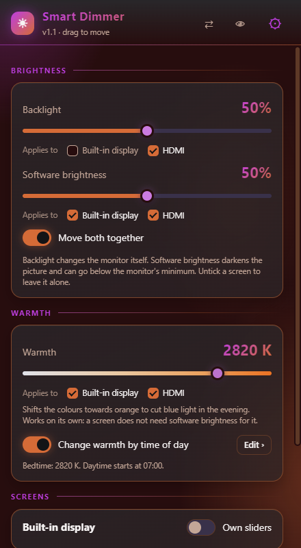 |

Automatic theme by time of day and weather (Appearance page):

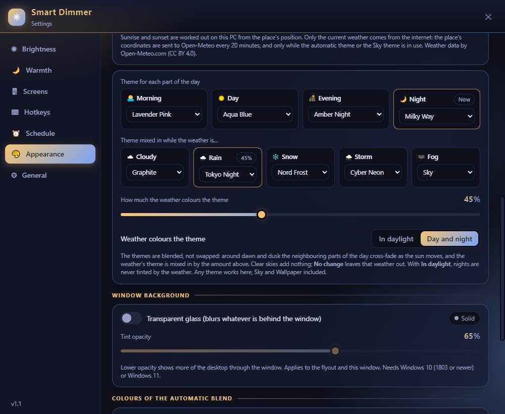

On-screen indicator, shown when a brightness hotkey is used:

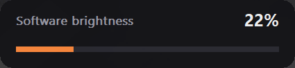

## Requirements

- Windows 10 (version 1803 or newer) or Windows 11, 64-bit.
- Microsoft Edge WebView2 Runtime. It ships with Windows updates. If it is missing or not ready, the
  hotkeys and schedule still work and the app tells you when you open its window.
  [Download](https://developer.microsoft.com/microsoft-edge/webview2/) (Evergreen, x64).
- For hardware brightness on an external monitor: a monitor and cable that support DDC/CI (most do;
  some monitors need DDC/CI enabled in their on-screen menu). Software dimming works everywhere.

## Install

1. Download `SmartDimmer-v1.1.0-win64.zip` from the [Releases](https://github.com/Xyberg-001/SmartDimmer/releases) page and extract it
   into a folder of your choice. Portable use (Documents, Desktop, a tools folder) keeps the settings
   next to the exe; in a folder you cannot write to, such as `Program Files`, they go to
   `%LOCALAPPDATA%\SmartDimmer` instead.
2. Run `SmartDimmer.exe`. On first start it extracts two files (`WebView2Loader.dll` and
   `SmartDimmerUI.html`) and creates `SmartDimmerSettings.ini`.
3. If Windows SmartScreen warns about an unsigned app, choose *More info* and *Run anyway*.
4. Optional: turn on *Start with Windows* on the General page of Settings.

To update, replace `SmartDimmer.exe`; your settings file is kept.

## Using it

The flyout is for everyday adjusting; Settings is for things you set once. Esc closes either.

- **Tray icon**: left click shows or hides the flyout; right click opens the menu (Settings, Swap
  primary display, Exit).
- **Flyout**: *Brightness* has the shared Backlight and Software brightness sliders, each with a tick
  per screen underneath: untick a screen to stop that adjustment on it at once. *Screens* has an
  *Own sliders* switch for each screen; its own sliders carry the same two ticks. *Warmth* tints the
  screens towards orange, with its own tick per screen, so it works without software brightness. *Schedule* turns
  the schedule on or off; *Edit ›* opens its page. The header buttons make the next screen the main
  one (⇄), identify the screens (👁) and open Settings (⚙).
- **Settings**: *Brightness* (how the sliders behave, dimming curve), *Warmth* (the warmth schedule), *Screens* (the same per-screen
  ticks, main screen), *Hotkeys*, *Schedule*, *Appearance*, *General* (start with Windows, defaults,
  about).
- **Backlight vs software brightness**: backlight changes the monitor itself; software brightness
  darkens the picture and can go below the monitor's minimum. Unticking software brightness on a
  screen returns it to normal immediately; unticking the backlight leaves it where it is.
- **Default hotkeys**: Ctrl + Up / Ctrl + Down for the backlight, Win + Up / Win + Down for software
  brightness. Change them on the *Hotkeys* page.

The complete reference of every control and every INI key is in [docs/SETTINGS.md](docs/SETTINGS.md).

## Files

| File | Where | What |
|---|---|---|
| `SmartDimmerSettings.ini` | next to the exe (or `%LOCALAPPDATA%\SmartDimmer`) | all settings; editable by hand while the app is closed |
| `SmartDimmerDebug.log` | same folder | diagnostic log, recreated at each start; attach it to bug reports |
| `WebView2Loader.dll`, `SmartDimmerUI.html` | same folder | extracted from the exe at each start; do not edit |
| `SmartDimmerWebView\` | `%TEMP%` | WebView2 profile and wallpaper thumbnails; safe to delete when the app is closed |
| `SmartDimmer.lnk` | Startup folder | created by *Start with Windows* |

Smart Dimmer makes no network connections, except one opt-in feature. When the automatic theme or
the Sky theme is in use and you have chosen a place, it asks [Open-Meteo](https://open-meteo.com/)
for the current weather every 20 minutes. Only the place's coordinates are sent, and searching for a
place sends the name you type. Sunrise and sunset are calculated on your PC.

## Building from source

Requirements: [AutoHotkey v2](https://www.autohotkey.com/) with its compiler (Ahk2Exe), installed to
`C:\Program Files\AutoHotkey` (or pass `-AhkDir`).

```powershell
.\build.ps1          # -> dist\SmartDimmer.exe
.\build.ps1 -Zip     # -> dist\SmartDimmer-v1.1.0-win64.zip
```

To run uncompiled during development: `"C:\Program Files\AutoHotkey\v2\AutoHotkey64.exe" src\SmartDimmer.ahk`
(the page and the loader DLL are read from `src\` and `src\lib\`).

Repository layout:

```
src/SmartDimmer.ahk       engine (AutoHotkey v2)
src/SmartDimmerUI.html    interface (rendered by WebView2)
src/lib/                  WebView2 binding for AutoHotkey (thqby, MIT) and WebView2Loader.dll (Microsoft)
assets/                   icon and screenshots
docs/                     SETTINGS.md (every option), ARCHITECTURE.md, TESTING.md
build.ps1                 compile and package
```

How it works is described in [docs/ARCHITECTURE.md](docs/ARCHITECTURE.md); how to test without
touching your monitors in [docs/TESTING.md](docs/TESTING.md).

## Troubleshooting

- **The external monitor does not react to the backlight slider.** Check that its *Backlight* tick is
  on (under the slider in the flyout), that DDC/CI is enabled in the monitor's menu,
  and that no other program (monitor OSD software, RGB tools) holds the DDC channel. The log shows
  `DDC/CI failed for monitor #n` when the monitor refuses the command. Software brightness is the
  fallback.
- **The laptop screen does not react.** Screen 1 is driven through WMI; some docks and external-GPU
  setups renumber screens. Use *Identify screens* and check the ticks on the *Screens* page.
- **Hotkey does not work.** Another program may own it (the log shows `could not bind`). Pick a
  different combination.
- **Glass is not transparent.** Glass needs Windows 10 1803+ and *Transparency effects* enabled in
  Windows' Personalisation > Colours. The app falls back to a solid background otherwise.
- **"Smart Dimmer could not open its window".** The WebView2 Runtime is missing or broken; install or
  repair it (link above). Hotkeys and the schedule keep working meanwhile.
- **Something went wrong.** Errors are written to `SmartDimmerDebug.log` (General > Open folder)
  instead of interrupting you; attach that file to an issue.
- **Making another screen main renumbered my screens.** Windows does that; the screen names stay
  correct, and the Screens page shows which ticks apply to which screen.

## Contributing

Issues and pull requests are welcome. Please attach `SmartDimmerDebug.log` and your Windows
version to bug reports. Keep the engine and the page in sync when adding a setting: state field in
`BuildState`, command in `HandleCommand`, INI key in `SaveSettings`/`LoadSettings`, defaults in
`FactoryState`/`CollectState`/`SetGlobalsFromState`, and a row in `docs/SETTINGS.md`.

## License

Smart Dimmer is released under the [MIT License](LICENSE). It bundles third-party components under
their own licences; see [THIRD_PARTY_NOTICES.md](THIRD_PARTY_NOTICES.md).
