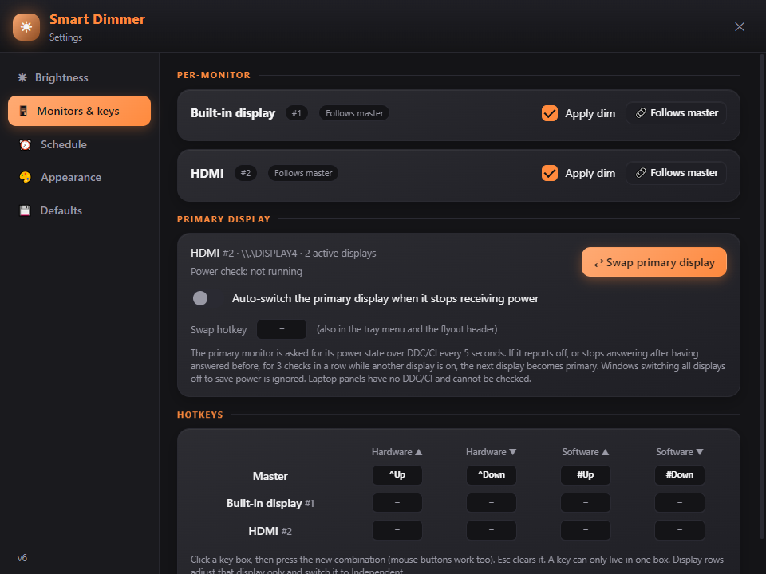

# Smart Dimmer

Hardware backlight and software dimming for every monitor on Windows 10 and 11, from a tray icon,
a flyout, global hotkeys and a time-of-day schedule. Standalone executable, no installation.


## Features

- **Two kinds of brightness.** *Hardware backlight* through DDC/CI on external monitors and WMI on the
  laptop panel, and *software dimming* through gamma ramps for screens that cannot be dimmed further
  (or at all) in hardware. Move them together or separately.
- **Per monitor.** Every display can follow the master levels or be *Independent* with its own sliders
  and its own hotkeys. Displays are shown by the names Windows reports for them.
- **Hotkeys.** Hardware and software up/down for the master level and for each display, captured from
  the keyboard or mouse buttons.
- **Schedule.** Up to 8 time-of-day entries with optional fading, wrapping past midnight, paused
  automatically when you adjust something by hand.
- **Dimming curve.** Linear or exponential mapping with a live preview, invert option and a limit on
  how dark software dimming can go.
- **Themes.** Five presets, a Custom theme, and a *Wallpaper* theme that builds its palette from the
  wallpaper of the screen each window is on, matching the picture's colours to the parts of the UI by
  the area they cover. Every theme can be edited colour by colour.
- **Glass.** Windows acrylic blur behind the windows with adjustable tint, rounded corners, and an
  optional frosted copy of the wallpaper behind the glass.
- **Primary display tools.** Swap the primary display with one click or a hotkey, and optionally let
  Smart Dimmer promote the next display when the primary stops receiving power.
- **Defaults.** Save the whole configuration, restore it, factory-reset, or load your defaults at
  every start.

| Settings: Brightness | Settings: Monitors & keys |
|---|---|
|  |  |

| Settings: Schedule | Settings: Appearance |
|---|---|
|  |  |

| Glass mode | Wallpaper theme |
|---|---|
|  |  |

## Requirements

- Windows 10 (version 1803 or newer) or Windows 11, 64-bit.
- Microsoft Edge WebView2 Runtime. It ships with Windows updates; if it is missing the app tells you
  at start. [Download](https://developer.microsoft.com/microsoft-edge/webview2/) (Evergreen, x64).
- For hardware brightness on an external monitor: a monitor and cable that support DDC/CI (most do;
  some monitors need DDC/CI enabled in their on-screen menu). Software dimming works everywhere.

## Install

1. Download `SmartDimmer-v1.0.0-win64.zip` from the [Releases](https://github.com/Xyberg-001/SmartDimmer/releases) page and extract it
   into a folder you can write to (Documents, Desktop, a tools folder), not `Program Files`.
2. Run `SmartDimmer.exe`. On first start it extracts two files next to itself (`WebView2Loader.dll`
   and `SmartDimmerUI.html`) and creates `SmartDimmerSettings.ini`.
3. If Windows SmartScreen warns about an unsigned app, choose *More info* and *Run anyway*.
4. Optional: turn on *Start with Windows* on the Brightness page of Settings.

To update, replace `SmartDimmer.exe`; your settings file is kept.

## Using it

- **Tray icon**: left click shows or hides the flyout; right click opens the menu (Settings, Swap
  primary display, Exit).
- **Flyout**: Targets (which monitors receive hardware commands), the schedule switch, the master
  sliders, and one card per display. The header has the swap-primary, identify and settings buttons.
  Drag it by the header, resize at any edge. It hides when it loses focus.
- **Default hotkeys**: `Ctrl+Up` / `Ctrl+Down` hardware backlight, `Win+Up` / `Win+Down` software
  brightness. Change them on the *Monitors & keys* page.
- **Independent displays**: click *Follows master* on a display card to give it its own sliders. The
  master sliders hide while any display is independent. A per-display hotkey switches that display
  to Independent automatically.

The complete reference of every control and every INI key is in [docs/SETTINGS.md](docs/SETTINGS.md).

## Files

| File | Where | What |
|---|---|---|
| `SmartDimmerSettings.ini` | next to the exe | all settings; editable by hand while the app is closed |
| `SmartDimmerDebug.log` | next to the exe | diagnostic log, recreated at each start; attach it to bug reports |
| `WebView2Loader.dll`, `SmartDimmerUI.html` | next to the exe | extracted from the exe at each start; do not edit |
| `SmartDimmerWebView\` | `%TEMP%` | WebView2 profile and wallpaper thumbnails; safe to delete when the app is closed |
| `SmartDimmer.lnk` | Startup folder | created by *Start with Windows* |

Smart Dimmer makes no network connections.

## Building from source

Requirements: [AutoHotkey v2](https://www.autohotkey.com/) with its compiler (Ahk2Exe), installed to
`C:\Program Files\AutoHotkey` (or pass `-AhkDir`).

```powershell
.\build.ps1          # -> dist\SmartDimmer.exe
.\build.ps1 -Zip     # -> dist\SmartDimmer-v1.0.0-win64.zip
```

To run uncompiled during development: `"C:\Program Files\AutoHotkey\v2\AutoHotkey64.exe" src\SmartDimmer.ahk`
(the page and the loader DLL are read from `src\` and `src\lib\`).

Repository layout:

```
src/SmartDimmer.ahk       engine (AutoHotkey v2)
src/SmartDimmerUI.html    interface (rendered by WebView2)
src/lib/                  WebView2 binding for AutoHotkey (thqby, MIT) and WebView2Loader.dll (Microsoft)
assets/                   icon and screenshots
docs/                     SETTINGS.md (every option), ARCHITECTURE.md, TESTING.md
build.ps1                 compile and package
```

How it works is described in [docs/ARCHITECTURE.md](docs/ARCHITECTURE.md); how to test without
touching your monitors in [docs/TESTING.md](docs/TESTING.md).

## Troubleshooting

- **The external monitor does not react to the hardware slider.** Check that its number is in
  *Targets* (numbers are listed under the field), that DDC/CI is enabled in the monitor's menu, and
  that no other program (monitor OSD software, RGB tools) holds the DDC channel. The log shows
  `DDC/CI failed for monitor #n` when the monitor refuses the command. Software dimming is the
  fallback.
- **The laptop screen does not react.** Monitor 1 is driven through WMI; some docks and external-GPU
  setups renumber displays. Use *Identify* to see the numbers and adjust *Targets*.
- **Hotkey does not work.** Another program may own it (the log shows `could not bind`). Pick a
  different combination.
- **Glass is not transparent.** Glass needs Windows 10 1803+ and *Transparency effects* enabled in
  Windows' Personalisation > Colours. The app falls back to a solid background otherwise.
- **The message about WebView2 at start.** Install the WebView2 Runtime (link above).
- **Swapping the primary display renumbered my displays.** Windows does that; the display names
  stay correct, only the `#n` numbers (and therefore *Targets*) may need adjusting.

## Contributing

Issues and pull requests are welcome. Please attach `SmartDimmerDebug.log` and your Windows
version to bug reports. Keep the engine and the page in sync when adding a setting: state field in
`BuildState`, command in `HandleCommand`, INI key in `SaveSettings`/`LoadSettings`, defaults in
`FactoryState`/`CollectState`/`SetGlobalsFromState`, and a row in `docs/SETTINGS.md`.

## License

Smart Dimmer is released under the [MIT License](LICENSE). It bundles third-party components under
their own licences; see [THIRD_PARTY_NOTICES.md](THIRD_PARTY_NOTICES.md).
